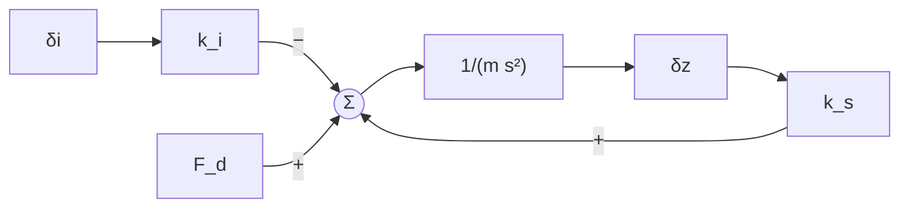
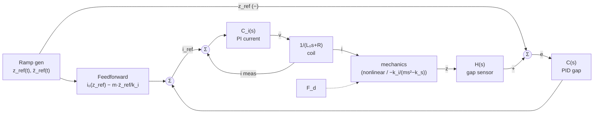

# Single Yoke — Linearization → s-Domain Plant → PID → Takeoff Ramp

*Scaled-down path: one 1"-deep U-yoke carrying a dummy payload, hanging under a steel track plate. Goals: derive the plant, design PID gains by hand, and plan the **takeoff** from the stops ($z_{start}$) to hover ($z_{equ}$). Check it all in a low-order sim before going to `tutorials/layer3_siso_stabilizer.py`.*

Numbers come from `tutorials/maglev/params.py` and are illustrative ($A = 1\,\text{in}^2$, $N=250$, $m=69$ kg). Swap them freely; the formulas are the deliverable.

---

## 0. Legend

### Coordinates & operating points

| Symbol | Meaning | Units |
|---|---|---|
| $z$ | Air gap, pole face → track plate. **Positive = open** (yoke hangs lower) | m |
| $z_{start}$ | Gap at rest on the stops/traction wheels. PM pull > weight here | m |
| $z_{equ}$ | Target hover gap. Chosen ≈ the **zero-power gap**, where the PM alone holds $mg$ ($i_0 = 0$). This is the point of HEMS | m |
| $z_0$ | **Any** point we linearize about (a generic point on the path $z_{start} \to z_{equ}$). $z_0 = z_{equ}$ is the hover design point | m |
| $z_{ref}(t)$ | Reference gap from the ramp generator | m |
| $\delta z = z - z_0$ | Small-signal gap deviation | m |
| $e = z - z_{ref}$ | Gap error. Gap too big → $e>0$ → more current | m |

### Electrical & magnetic

| Symbol               | Meaning                                                           | Units  |
| -------------------- | ----------------------------------------------------------------- | ------ |
| $i$, $i_{ref}$       | Coil current, commanded coil current                              | A      |
| $i_0(z_0)$           | Current that holds equilibrium at $z_0$. $i_0(z_{equ}) \approx 0$ | A      |
| $\delta i = i - i_0$ | Small-signal current                                              | A      |
| $v$                  | Coil voltage (driver output)                                      | V      |
| $N$, $R$             | Coil turns, coil resistance                                       | –, Ω   |
| $A$                  | Pole-face area (1 in², per leg)                                   | m²     |
| $\mathcal{R}_0$      | Gap-independent reluctance (PM + steel)                           | A/Wb   |
| $\mathcal{R}(z)$     | Total loop reluctance at gap $z$                                  | A/Wb   |
| $\mathcal{F}_{pm}$   | PM magnetomotive force (Thévenin source)                          | A·turn |
| $\phi$, $\phi^*$     | Loop flux; flux at **any** equilibrium, $\sqrt{mg\mu_0A}$         | Wb     |
| $L(z)$, $L_0$        | Coil inductance $N^2/\mathcal{R}(z)$; its value at $z_{equ}$      | H      |
| $\eta$               | Gap share of the loop reluctance, $\mathcal{R}_{gap}/\mathcal{R}$ | –      |

### Mechanical & linearized

| Symbol | Meaning | Units |
|---|---|---|
| $m$ | **Total** suspended mass: yoke + dummy payload + brackets (constant) | kg |
| $F$, $F_0$ | Magnet pull (upward); its equilibrium value $= mg$ | N |
| $F_d$ | Small disturbances only (air, nudges). **Positive = downward** | N |
| $k_i(z_0)$ | Current stiffness $\partial F/\partial i$ | N/A |
| $k_s(z_0)$ | Negative-spring stiffness $-\partial F/\partial z$ (magnitude) | N/m |
| $b = k_i/m$, $p = \sqrt{k_s/m}$ | Plant gain; RHP pole | m/(A·s²), rad/s |
| $\lambda(z_0)$ | Plant scale factor $\mathcal{R}(z_{equ})/\mathcal{R}(z_0)$ | – |

### Controller

| Symbol | Meaning |
|---|---|
| $C(s)$ | Outer gap PID: $K_p + K_i/s + K_d s/(\tau s+1)$ |
| $C_i(s)$, $T_i(s)$ | Inner PI current loop ($K_{pi}, K_{ii}$); its closed loop $\omega_c/(s+\omega_c)$ |
| $\omega_n, \zeta, \alpha$ | Placed pole speed, damping, integral-pole ratio |
| $\omega_c$, $\omega_{gc}$ | Inner-loop bandwidth; outer-loop gain crossover |
| $H(s)$ | Gap sensor dynamics |
| $I_{max}$, $V_{max}$ | Driver current / voltage limits |
| $T_r$ | Takeoff ramp duration |

---

## 1. Assumptions (what "low-order" throws away)

| Kept | Dropped (for now) |
|---|---|
| 1 DOF heave, rigid mass, constant $m$ | pitch/roll, pod, other yokes |
| PM as Thévenin MMF source, linear iron | saturation (matters most near $z_{start}$), hysteresis, eddy lag |
| Small signal about $(i_0, z_0)$ | motional back-EMF (inner loop rejects it) |
| Inner current loop ≈ 1st-order lag | sensor noise, quantization |
| Stops as a one-sided contact at $z_{start}$ | contact dynamics, wheel compliance |

---

## 2. Nonlinear model

$$
\mathcal{R}(z) = \mathcal{R}_0 + \frac{2z}{\mu_0 A},\qquad
\phi = \frac{N i + \mathcal{F}_{pm}}{\mathcal{R}(z)},\qquad
F = \frac{\phi^2}{\mu_0 A}
$$

$$
m\ddot z = mg - F(i,z) + F_d, \qquad
v = R\,i + L(z)\,\frac{di}{dt}
$$

Gravity opens the gap and the magnet closes it, so the system is **unstable** (a saddle).

---

## 3. The family of equilibria (every point on the takeoff path)

Equilibrium at $z_0$ means $F = mg$, so **the flux is the same at every equilibrium**:

$$
\phi^* = \sqrt{mg\,\mu_0 A}
\qquad\Rightarrow\qquad
\boxed{\,i_0(z_0) = \frac{\phi^*\mathcal{R}(z_0) - \mathcal{F}_{pm}}{N}\,}
$$

- $i_0$ is **linear in $z_0$**, with slope $\dfrac{di_0}{dz_0} = \dfrac{2\phi^*}{\mu_0 A N}$.
	- ***==Is this actually correct? Corroborate against the Maple model which yields a z-squared, i-squared relation==***
- **Zero-power gap** ($i_0 = 0$): $\mathcal{R}(z_{equ}) = \mathcal{F}_{pm}/\phi^*$ → $z_{equ} = \dfrac{\mu_0 A}{2}\left(\dfrac{\mathcal{F}_{pm}}{\phi^*} - \mathcal{R}_0\right)$.
- For $z_0 < z_{equ}$ (closer to the track): $i_0 < 0$, the coil current **opposes** the PM field

**Takeoff feasibility** (check first). Holding at $z_{start}$ needs:

$$
|i_0(z_{start})| = \frac{2\phi^*}{\mu_0 A N}\,(z_{equ} - z_{start}) \;\le\; I_{max}
$$

This sets how close the stops may put the yoke.

---

## 4. Linearize about a generic $z_0$

$$
F \approx mg + k_i\,\delta i - k_s\,\delta z
$$

$$
k_i(z_0) = \frac{2\phi^* N}{\mu_0 A\,\mathcal{R}(z_0)},
\qquad
k_s(z_0) = \frac{4\,mg}{\mu_0 A\,\mathcal{R}(z_0)} = \frac{2mg}{z_0}\,\eta(z_0)
$$

$$
\boxed{\,m\,\delta\ddot z = -k_i\,\delta i + k_s\,\delta z + F_d\,}
$$

Current closes the gap ($-k_i$). Opening the gap weakens the pull, so it keeps opening ($+k_s$).

### Two structural facts

1. **The ratio is constant along the path:**
$$
\frac{k_s}{k_i} = \frac{2\phi^*}{\mu_0 A N} = \frac{di_0}{dz_0}
$$
This single number sets the stability floor on $K_p$ (§7a), the current cost per mm of takeoff (§3), and the steady current per mm of gap offset.

2. **The whole plant family is one plant, scaled:**
$$
b(z_0) = \lambda\,b_{equ},\quad p^2(z_0) = \lambda\,p^2_{equ},\qquad \lambda(z_0) = \frac{\mathcal{R}(z_{equ})}{\mathcal{R}(z_0)}
$$
Because the PM dominates $\mathcal{R}$ ($\eta \approx 0.11$), **$\lambda$ stays close to 1** over a sub-mm ramp.

### ~~Numbers (this yoke, $z_{equ}$ = zero-power gap)~~

| ~~Quantity~~                                | ~~Value~~                                 |
| --------------------------------------- | ------------------------------------- |
| ~~$\phi^*$~~                                | ~~7.41×10⁻⁴ Wb~~                          |
| ~~$z_{equ}$~~                               | ~~**3.10 mm** ($i_0 = 0$)~~               |
| ~~$\eta$~~                                  | ~~0.113~~                                 |
| ~~$k_i$, $k_s$~~                            | ~~6.76 N/A, 4.94×10⁴ N/m~~                |
| ~~$k_s/k_i = di_0/dz_0$~~                   | ~~**7.31 A/mm**~~                         |
| ~~$p$~~                                     | ~~**26.8 rad/s (4.26 Hz)**~~              |
| ~~$b$~~                                     | ~~0.0980 m/(A·s²)~~                       |
| ~~$L_0$, $R/L_0$~~                          | ~~0.93 mH, 2160 rad/s~~                   |
| ~~Max takeoff distance at $I_{max} = 5$ A~~ | ~~$z_{equ} - z_{start} \le$ **0.68 mm**~~ |

### ~~Along the path~~

| ~~$z_0$ [mm]~~           | ~~$\lambda$~~ | ~~$i_0$ [A]~~ | ~~$k_i$ [N/A]~~ | ~~$k_s$ [N/m]~~ | ~~$p$ [rad/s]~~ |
| -------------------- | --------- | --------- | ----------- | ----------- | ----------- |
| ~~2.60 ($z_{start}$)~~   | ~~1.019~~     | ~~−3.66~~     | ~~6.89~~        | ~~50 360~~      | ~~27.0~~        |
| ~~2.85~~                 | ~~1.009~~     | ~~−1.83~~     | ~~6.82~~        | ~~49 890~~      | ~~26.9~~        |
| ~~**3.10 ($z_{equ}$)**~~ | ~~1.000~~     | ~~0~~         | ~~6.76~~        | ~~49 440~~      | ~~26.8~~        |
| ~~3.35~~                 | ~~0.991~~     | ~~+1.83~~     | ~~6.70~~        | ~~48 990~~      | ~~26.7~~        |

> ~~**Takeaway:** along the path the *dynamics* barely change (λ within 2%), but the *hold current* changes a lot. Takeoff is a **feedforward** problem, not a gain-scheduling problem, at least for this PM-dominated yoke.~~

---

## 5. s-Domain plant (at $z_0$)

$$
G_z(s) = \frac{\delta Z}{\delta I} = \frac{-k_i}{m s^2 - k_s} = \frac{-b}{(s-p)(s+p)}
\qquad
G_d(s) = \frac{\delta Z}{F_d} = \frac{1/m}{s^2 - p^2}
$$

$$
G_e(s) = \frac{I}{V} = \frac{1}{L_0 s + R}
\qquad\Rightarrow\qquad
\frac{\delta Z}{V} = \frac{-k_i}{(L_0 s + R)(m s^2 - k_s)}
$$

The poles are at $s = \pm p$ (mechanical saddle) and $s = -R/L_0$ (electrical). The RHP pole means it drops off in about $1/p \approx 37$ ms.

### Plant internals: the negative spring is a *positive* feedback loop



---

## 6. Closed-loop block diagram (ramp + feedforward + nested loops)



- $e = z - z_{ref}$ is reverse-acting, which cancels the plant's minus sign. The loop gain is $L = C\,T_i\,H\cdot b/(s^2-p^2)$.
- Timescale separation: **inner loop ≫ outer loop ≫ p ≫ 1/T_r**. The outer design sees $P(s) \approx b/(s^2-p^2)$.

---

## 7. Controller design at $z_{equ}$

### Inner current loop: PI by pole–zero cancellation

$$
K_{pi} = \omega_c L_0,\quad K_{ii} = \omega_c R
\;\Rightarrow\; C_iG_e = \frac{\omega_c}{s}
\;\Rightarrow\; \boxed{T_i(s) = \frac{\omega_c}{s+\omega_c}}
$$

With $\omega_c = 2\pi\cdot1$ kHz: $K_{pi} = 5.8$ V/A, $K_{ii} = 1.26\times10^4$ V/(A·s).

### 7a. P only fails

$s^2 + (bK_p - p^2) = 0$. At best the poles sit on the $j\omega$ axis. The stability floor is $K_p > k_s/k_i$ (= 7.3 A/mm, the same everywhere on the path).

### 7b. PD by pole placement

$$
s^2 + bK_d s + (bK_p - p^2) = s^2 + 2\zeta\omega_n s + \omega_n^2
\;\Rightarrow\;
\boxed{K_p = \frac{\omega_n^2 + p^2}{b},\quad K_d = \frac{2\zeta\omega_n}{b}}
$$

It leaves a steady offset $\delta z_{ss} = F_d/(k_iK_p - k_s)$.

### 7c. PID by pole placement

$$
s^3 + bK_d s^2 + (bK_p - p^2)s + bK_i = (s+\alpha\omega_n)(s^2 + 2\zeta\omega_n s + \omega_n^2)
$$

$$
\boxed{K_p = \frac{(1+2\zeta\alpha)\omega_n^2 + p^2}{b},\quad
K_i = \frac{\alpha\omega_n^3}{b},\quad
K_d = \frac{(2\zeta+\alpha)\omega_n}{b}}
$$

Routh: $bK_d > 0,\; bK_p > p^2,\; bK_d(bK_p - p^2) > bK_i$.
>==TODO: Is this just an expansion of a2a1 > a3a0 for solving zeroes of third-order characteristic equation (stability proof)?==

**The integrator's job here** (zero-power $z_{equ}$, constant $m$) is to trim **model error**, not gravity: the $\mathcal{F}_{pm}$ tolerance and temperature drift, errors in the $m$ estimate, and gap machining tolerance. Any of these makes the real $i_0(z_{equ}) \ne 0$. Keep α small.

### 7d. Design window

$$
p \;<\; \omega_{gc} \;\lesssim\; \min\!\Big(\tfrac{\omega_c}{10},\; \tfrac{\omega_s}{10},\; \tfrac{1}{3T_{delay}}\Big)
$$

Rule of thumb: $\omega_n \approx 2$–$3\,p$. The current-limit ceiling is a linear range of about $I_{max}/K_p$.

---

## 8. Takeoff: $z_{start} \to z_{equ}$

**==Points to Check Here:==**
- ==Intuition behind feed-forward serving as the ramp? How?== 
- ==In theory, the ramp is not needed. However, we have proven it in practice where ramp-up works and lack thereof fails (yoke falls).== 
	- ==Could be a tuning issue -> reduce or cap Kp-action at low gaps instead of tanh ramp==
	- ==On the other hand... the "theory" here is arriving at a smaller z_{equ} which is not representative.==

### 8a. Is a fixed-gain design stable along the whole path? (frozen-point check)

With gains designed at $z_{equ}$, at any other $z_0$:

$$
\omega_n^2(z_0) \approx \lambda\,\omega_{n0}^2,\qquad \zeta(z_0) \approx \zeta_0\sqrt{\lambda}
$$

(Exact for PD; approximate for PID.) Closer to the track ($\lambda>1$) the loop is slightly faster and better damped. The $K_p$ floor doesn't move, so **it is stable at every frozen point**.

- **Gain schedule (optional):** multiply all gains by $1/\lambda(z_{ref}) = \mathcal{R}(z_{ref})/\mathcal{R}(z_{equ})$ to pin the poles. That's a one-liner, and worth it only if $\lambda$ drifts far from 1 (small $\eta$ → no; saturated iron near $z_{start}$ → maybe).

### 8b. Feedforward carries the known part

$$
i_{ref} = \underbrace{i_0(z_{ref})}_{\text{hold}} \;\underbrace{-\;\frac{m\,\ddot z_{ref}}{k_i(z_{ref})}}_{\text{accelerate}} \;+\; \underbrace{C(s)\,e}_{\text{fix the rest}}
$$

Feedback then only sees model error and $F_d$. The error stays small, so the linearization stays valid along the whole ramp.

### 8c. Ramp profile and its limits

Use a smooth profile with bounded $\ddot z$, e.g. minimum-jerk with $\tau = t/T_r$:

$$
z_{ref}(t) = z_{start} + (z_{equ} - z_{start})\,(10\tau^3 - 15\tau^4 + 6\tau^5)
$$

(tanh also works; min-jerk ends exactly at $T_r$ with $\dot z = \ddot z = 0$.)

| Constraint | Condition |
|---|---|
| Quasi-static (frozen-point argument valid) | $T_r \gtrsim 10/\omega_n$ |
| Current | $\lvert i_0(z_{ref})\rvert + m\lvert\ddot z_{ref}\rvert/k_i \le I_{max}$ |
| Voltage | $L\,\lvert di_{ref}/dt\rvert + R\lvert i\rvert \le V_{max}$ |

A "stability check at each step" is redundant given 8a. The ramp only needs to satisfy this table.

### 8d. Start-up sequence

1. On the stops: $z = z_{start}$, contact force carries $F - mg > 0$. Linearization doesn't apply yet (one-sided contact).
2. Set $z_{ref} = z_{start}$, $i_{ref} = i_0(z_{start}) < 0$. The current ramps in about $L\,|i_0|/V_{max}$, net force → 0, and the yoke lifts off gently.
3. Run the ramp to $z_{equ}$. Optionally hold the integrator until liftoff (it winds while pinned).
4. Hover. $i \to 0$ plus whatever the integrator trims.

---

## 9. Worked design & verification

$\omega_n = 2p = 53.5$ rad/s, $\zeta = 0.7$, $\alpha = 0.25$, $\tau = 1/(2\pi\cdot300)$.

| | $K_p$ [A/m] | $K_i$ [A/(m·s)] | $K_d$ [A·s/m] |
|---|---|---|---|
| PD | 36 550 | — | 765 |
| PID | 46 790 | 3.91×10⁵ | 901 |

### Linear (python-control, inner loop + D filter included)

| $z_0$ | Dominant CL poles [rad/s] | PM | $\omega_{gc}$ |
|---|---|---|---|
| 2.60 mm | −40.9 ± 37.8j, −13.5 | 56.6° | 93 rad/s |
| 3.10 mm | −40.0 ± 38.1j, −13.4 | 56.2° | 92 rad/s |
| 3.35 mm | −39.6 ± 38.2j, −13.4 | 56.0° | 91 rad/s |
| 3.10 mm + 0.75 ms delay | stable | 52.2° | — |

- The poles land where they were placed, and fixed gains hold them across the path (the λ-scaling claim checks out).
- GM ≈ 0.25 is a *downward* margin (expected with an RHP pole): the gain can drop 4× before it falls.
- 20 N disturbance step: peak +67 µm, returns to 0 (PD alone: +101 µm steady).

### Nonlinear takeoff (0.5 mm, 2.60 → 3.10 mm, clamps 5 A / 24 V, D on measurement)

| Reference | Overshoot past $z_{equ}$ | Coil current range |
|---|---|---|
| Step to $z_{equ}$ | 50 µm | −5.00 (**clamped**) … +2.6 A |
| Min-jerk ramp, $T_r$ = 0.3 s, no FF | 66 µm | −4.7 … +0.9 A |
| Min-jerk ramp, $T_r$ = 0.3 s, **with FF** | 40 µm | −3.8 … +0.6 A |
| + FF, $T_r$ = 0.6 s | 14 µm | — |
| + FF, $T_r$ = 1.0 s | 5 µm | — |

- The step **didn't fall** here: the 5 A clamp acted as an accidental slew limit. But it ran saturated (nonlinear, unanalyzable). The ramp keeps you in the linear region where §7 is valid.
- FF + a slower ramp is the lever. $T_r \approx 0.6$–$1$ s gives an overshoot of ~10 µm.

### Reference path (set-point step, same poles)

| Structure | Overshoot | Peak $i_{ref}$ |
|---|---|---|
| PID on error | 41 % | 174 A (derivative kick) |
| PI-D (D on measurement) | 39 % | 4.7 A |
| I-PD (P & D on measurement) | 0 % | 0.73 A, slower |

---

## 10. Low-order sim recipe

```python
import numpy as np, control as ct
s  = ct.tf('s')
P  = lambda z0: (ki(z0)/m) / (s**2 - ks(z0)/m)   # = -G_z, sign absorbed by e = z - z_ref
Ti = wc / (s + wc)
C  = Kp + Ki/s + Kd*s/(tau*s + 1)
for z0 in np.linspace(z_start, z_equ, 5):        # frozen-point sweep along the ramp
    L = C * Ti * P(z0)
    print(z0, ct.poles(ct.feedback(L, 1)), ct.margin(L)[1])
```

The ladder: **linear at $z_{equ}$ → frozen-point sweep → + inner loop/delay → nonlinear ramp sim with stops and clamps (§8d)**. Each rung should move poles and margins only a little. A big jump means a timescale assumption broke.

---

## 11. Check yourself

1. Why does $k_s/k_i$ equal $di_0/dz_0$? What does that say about the current "price" of starting closer to the track?
2. What happens to $\lambda$ over the ramp if the iron saturates near $z_{start}$, and does gain scheduling become worth it?
3. The integrator winds while the yoke is pinned on the stops. What does that do at liftoff, and how would you prevent it?

*Related:* [[Maglev - PM Bias and Force Linearization]] · [[Maglev - Control Theory Fundamentals]] · `tutorials/layer2_current_loop.py` · `tutorials/layer3_siso_stabilizer.py`
